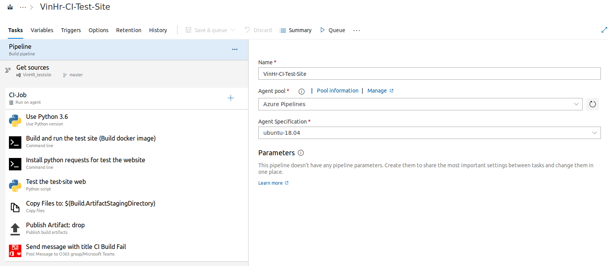
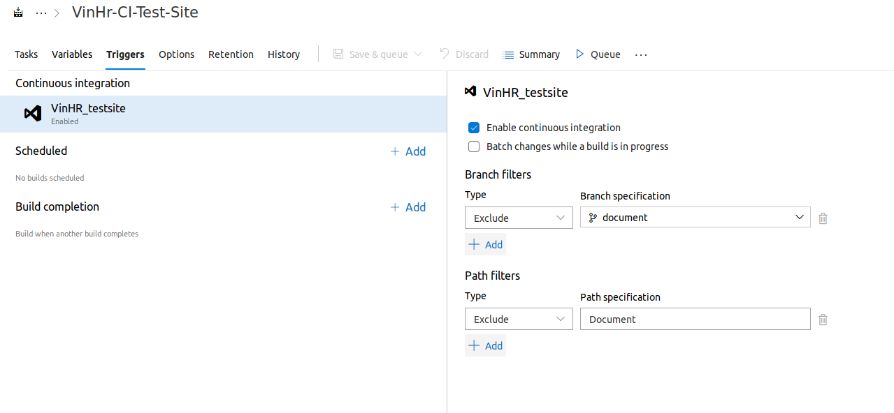
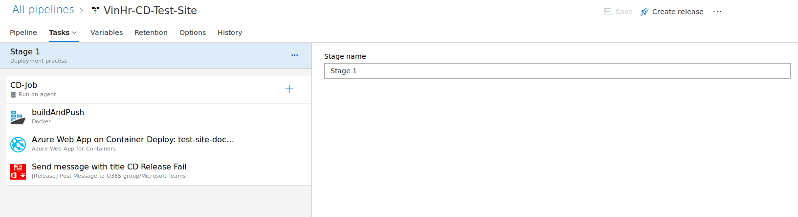

# CI/CD for auto deploy VinHR test site
This document contains the CI/CD design for VinHR test site.

The flow includes:

    1. Dev push code to dev branch

    2. Dev create new pull request

    3. Code check-in to master if pull request pass the quality gateway

    4. CI trigger event pull request approved and run CI job (if fail, send message to Teams)

    5. CD trigger event CI job success and run CD job (if fail, send message to Teams)

In this document, we focus on the process of CI/CD. The test site repo deploys base on Docker, I created a Dockerfile, and it will not change in the near future.

## 1. CI

CI will trigger the master branch when a pull request was merged to master (set up in Trigger and Run Job Agent). Output of CI is the artifact for source code in case build success or message in Microsoft Teams in case build fail.

CI contain four tasks:

    • Build the image from Dockerfile

    • Run integration test base on the Docker image that was built (for now there are not have IT test so that task number one and two now is blank. They will be added when IT script’s ready on master branch) 
   
    • Public source code to Artifact 
   
    • Send message to teams in case there was a fail job

In CI, I set up the trigger is exclude the folder Document when new pull request is approved to master. It means that if a developer commit a Document to master, the CI/CD pipeline will not execute.

## 2. CD

CD will trigger an event when an artifact 
creates (CI build success). Output of CD is web-site (link is [links](https://test-site-docker.azurewebsites.net/))

CD contains the artifact trigger and state that includes three tasks. The three tasks are:

    • Build and push image from artifact to Azure cloud

    • Deploy image to Web App (a service in Azure)

    • Send message to Microsoft Teams in case release fail

## 3. Some note about writing Dockerfile for the test site

The DevOps must know about the command in Dockerfile.For example:

A and B had a task that they have to deploy a web to cloud using Docker technique. A and B did not know how to configure a web server (Nginx for instance) and Docker, so they decided to make a copy Dockerfile from google and here was the Dockerfile they had get

> FROM tiangolo/uwsgi-nginx-flask:python3.7
> 
> RUN apt-get -y update
> 
> RUN apt-get install -y vim
>
> ADD requirements.txt .
> 
> RUN pip install -r requirements.txt
> 
> COPY . /app
> 
> ENTRYPOINT ["python"]
> 
> CMD ["app.py"]

When they tried to deploy to Azure Cloud, the web was working perfect (with one or two requests, that was OK), and they were very happy about that. However, they did not know that they made a mistake that the “CMD” and “ENTRYPOINT” started the web with the debug webserver (werkzeg). With 20 requests, I’m sure that the web site will down. Lucky that C found that and fix the Dockerfile for them. C was clone an existing Dockerfile that include Nginx and uwsgi from here, chose version of the language (python 3.6) and modify two file: Dockerfile and uwsgi.ini

> [uwsgi]
> 
> module = main:server
> 
> \# main is file name want to execute (main.py), server is an object of framework flask (in main.py must define the variable name server that mount to flask server object)

Dockerfile

> FROM tiangolo/uwsgi-nginx:python3.6
> 
> RUN pip install flask
> 
> \# URL under which static (not modified by Python) files will be requested
> 
> \# They will be served by Nginx directly, without being handled by uWSGI
> 
> ENV STATIC_URL /static
> 
> \# Absolute path in where the static files wil be
> 
> ENV STATIC_PATH /app/static
> 
> \# If STATIC_INDEX is 1, serve / with /static/index.html directly (or the static URL configured)
> 
> \# ENV STATIC_INDEX 1
> 
> ENV STATIC_INDEX 0
> 
> \# Add demo app
> 
> COPY ./app /app
> 
> WORKDIR /app
> 
> \# Make /app/* available to be imported by Python globally to better support several use cases like Alembic migrations.
> 
> ENV PYTHONPATH=/app
> 
> \# Move the base entrypoint to reuse it
> 
> RUN mv /entrypoint.sh /uwsgi-nginx-entrypoint.sh
> 
> \# Copy the entrypoint that will generate Nginx additional configs
> 
> COPY entrypoint.sh /entrypoint.sh
> 
> RUN chmod +x /entrypoint.sh
> 
> RUN pip install -r /app/requirements.txt
> 
> EXPOSE 80
> 
> ENTRYPOINT ["/entrypoint.sh"]
> 
> \# Run the start script provided by the parent image tiangolo/uwsgi-nginx.
> 
> \# It will check for an /app/prestart.sh script (e.g. for migrations)
> 
> \# And then will start Supervisor, which in turn will start Nginx and uWSGI
> 
> CMD ["/start.sh"]

The note here is “DevOps should know how something works before deploy them.”. 
